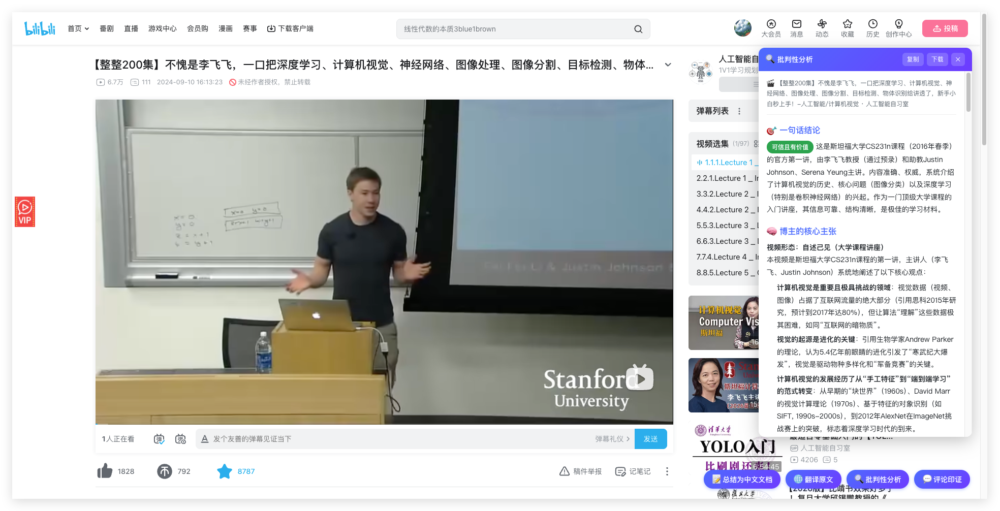
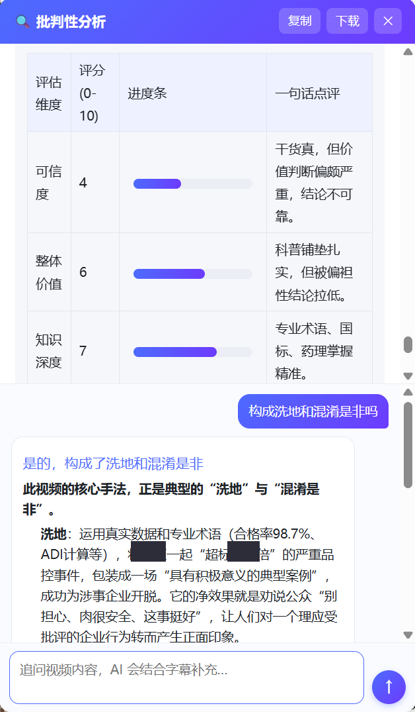
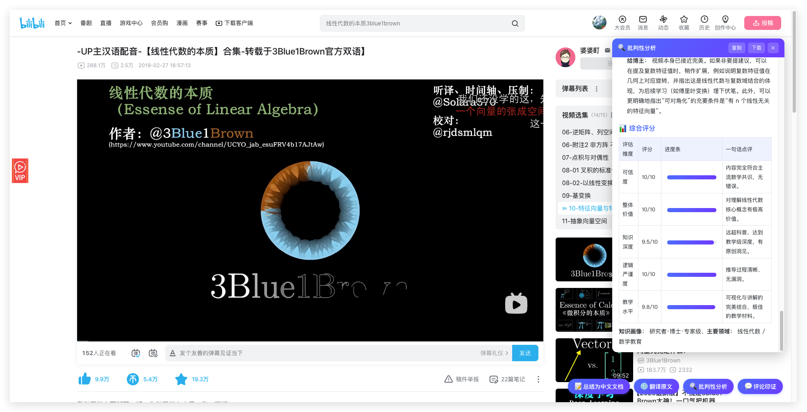
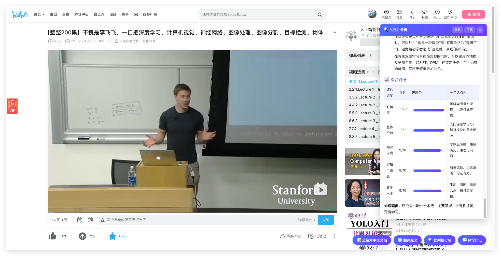

# 🧰 DeepSeek 工具箱

### 在 YouTube / 哔哩哔哩 视频页，一键调用 AI —— 看懂它，更**看透**它

  
  
  
  

<i>打开视频 · 点一下按钮 · 右侧面板实时生成结果</i>

---

## 🎯 为什么做这个？

短视频时代，**最贵的不是钱，是被烂内容偷走的时间和判断力。**

「日入过万的副业」「3 个月逆袭」「专家不会告诉你的秘密」—— 真数据、真截图、真操作，看起来无懈可击。可它们往往**只给你看冰山一角**，把高风险包装成「人人可复制」，最后用一份「免费资料」把你引进私域收割。

这个扩展不替你下结论，它做一件事：**把博主刻意回避的部分，摆到你面前。**
先肯定合理处，再点出夸大与存疑，逐条评估论据强度，识别话术套路，匹配经典骗局原型，最后给一个**可信度 + 价值的双评分**。看完再决定值不值得信、值不值得花时间。

---

## ✨ 它能做什么

> 同一个视频，四种看法。抓取逻辑按平台适配，差异只在交给 DeepSeek 的提示词，**两个平台都同时拥有这四种能力**。

<table>
<tr>
<td width="50%" valign="top">

### 📝 总结成中文笔记
抓取视频字幕，一键生成**结构化中文要点**。冗长的讲座、播客，几秒钟读完核心。

</td>
<td width="50%" valign="top">

### 🌐 逐句翻译原文
**保留时间戳**的全文翻译，逐句对照，不做删减总结，适合精读外语视频。

</td>
</tr>
<tr>
<td width="50%" valign="top">

### 🔍 批判性分析 ⭐
公允评估博主**说得对不对**：先肯定合理处，再点出夸大与存疑；逐条评估论据强度，识别「巴纳姆效应、制造焦虑、诉诸虚假权威、稻草人」等话术（区分正常修辞与操纵），匹配经典骗局原型，核查科学依据，给出**可信度 + 价值双评分**。

</td>
<td width="50%" valign="top">

### 💬 评论印证
读取热门评论 + 字幕**一起分析**：判断评论能否真正**佐证**视频，主动识别「粉丝附和 ≠ 独立印证、回音室、刷屏控评、幸存者偏差、高赞 ≠ 正确」等陷阱，重视质疑声而非一味吹捧。

</td>
</tr>
</table>

> 💬 **追问对话**：任何一种结果生成后，面板底部会出现对话框。直接输入问题，AI 会**结合视频字幕**接着聊、补充细节、答疑解惑 —— 看完总结还有疑问，不必重新生成，问就行。

---

## 🕵️ 实战案例：它怎么分辨「割韭菜」和「真干货」

> 四个真实视频，从割韭菜、软广、洗地到真干货，同一个「批判性分析」。**烂的打码，好的署名。**

| 视频 | 一句话结论 | 可信度 | 价值 |
|------|------|:---:|:---:|
| 💸 「躺赚副业」教学 `×哥`卖虚拟素材 | 真数据掩护，回避版权/封号风险，免费手册做私域引流 | 🔴 **3** | 4 |
| 💊 中医研究生 vlog 带货 某 OTC 中成药 | 个人轶事冒充临床证据，软广伪装科普，结尾挂购物链接 | 🔴 **2** | 1 |
| 🧪 食品安全「洗地」科普 某肉企抗生素超标 | 数据全真，却用整体合格率稀释个案、把企业漏检包装成「积极典型」 | 🟠 **4** | 6 |
| 📐 3Blue1Brown 微积分科普 隐函数求导 | 几何直觉讲透原理，论证严谨、无利益相关 | 🟢 **9** | 9 |

> 💡 它不是无脑唱衰——**烂的打 2 分，好的给 9 分**。每个评分背后是约 20 个维度的逐条拆解。点开看完整版长什么样：

<b>📂 案例一　「躺赚副业」教学：真数据掩护下的避重就轻</b>

> 某博主（化名 `×哥`，开 `某豪车` 立人设）在某二手平台教「卖虚拟素材月入数万」，后台数据真实，评论区一片「感谢大佬」。**点一下「批判性分析」——**

**一句话结论　⚠️ 喜忧参半**：一个「凭真数据 + 真操作」包装的避重就轻式副业教学，把高风险灰色操作包装成「人人可复制的干货」。

- 🚫 **回避版权风险**：`0.×` 元甩卖的素材几乎必然未授权，只字不提侵权诉讼
- 🚫 **回避平台封号**：低客单 + 高销量极易触发风控，被包装成「选品技巧」
- 🚫 **幸存者偏差**：「日入 `5××`」是成功个案，没说多少人照做后是零蛋
- 🎭 **说服手法**：真实数据做社会认同 → 免费手册做互惠钩子 → 豪车人设做权威暗示
- 🔗 **套路匹配**：典型【知识付费漏斗】，免费引流 → 建信任 → 私域收割

> 💰 一句话戳破：**它的目标不是让你看完视频，是让你成为他的下一个卖家。**

<b>📂 案例二　中医研究生 vlog 带货：个人故事冒充临床证据</b>

> 「中医研究生给男友补肾」的 vlog，专业身份 + 真实感 + 「实验室临床项目」营造科学感，结尾挂出某 OTC 中成药购物链接。**批判性分析给出：可信度 2 / 价值 1 / 逻辑严谨度 1。**

- 🧪 **「临床测试」无对照、无双盲、无客观指标**——是「试用故事」，不是临床试验
- 📉 **主观当客观**：把「泡沫尿变少、皮肤变白」当成「肾精回补的客观证据」
- 💸 **利益绑定**：自曝「男友入组我能拿奖金」，观察天然有偏
- 🐟 **红鲱鱼**：用「实验室 / OTC 认证 / 几十味名贵中药」制造科学感，转移「疗效证据不足」
- ⚖️ **疑似违反广告法**：借专业人士 / 学术机构名义为商品作推荐证明

> 💊 一句话戳破：**用「个人故事」替代「科学证据」，可能让真有困扰的人延误正规就医。**

<b>📂 案例三　食品安全「洗地」：数据全真，结论却在替企业卸责</b>

> 某科普 UP 主解读「某大型肉企猪肉抗生素（林可霉素）超标数十倍」事件——药理、国标、ADI 讲得专业准确，却把结论引向「大家不必担心」。批判性分析（含 🚩 红队预读）给出：**可信度 4 / 逻辑严谨度 4**。

- 🚩 **红队预读命中**：分析前先预判「若这是洗地会怎么洗」，再对照字幕逐条坐实
- 📊 **用整体稀释个案**：拿「98.7% 合格率」消解「这一批超标数十倍」，以偏概全
- ⚖️ **偷换风险尺度**：把 ADI 的「合规上限处安全」偷换成「吃一顿超标肉也没事」（安全剂量 ≠ 安心剂量）
- 🐟 **转移焦点**：把「企业为何漏检」的追问，引导成「还好监管帮忙补上了」
- 🏭 **替企业卸责**：把「被监管逼出来的亡羊补牢」包装成「富有远见的积极典型」
- 🤐 **把质疑定义成「焦虑」**：用「不制造焦虑」收尾，消解公众合理的知情追问

**💬 看完还能追问**（结果生成后直接接着问，AI 结合字幕回答）：

> **我问**：构成洗地和混淆是非吗？
> **AI 答**：是的。它用真实数据 + 专业术语（合格率 98.7%、ADI 计算），把某肉企「超标数十倍」的严重品控事件，包装成一场「具有积极意义的典型案例」，成功为涉事企业开脱——净效果就是劝公众「别担心、肉很安全」，让人对一个理应受批评的企业行为转而产生正面印象。

 
👆 追问对话实际界面 · 敏感信息已打码

> 🧊 一句话戳破：**它最难防的地方，是每个数据都真——洗地不靠撒谎，靠的是「叙事框架」。**

<b>📂 案例四　3Blue1Brown 微积分科普：它也会「认好东西」</b>

> 同一套分析，遇到真正的好内容会怎样？**可信度 9 / 价值 9 / 教学 9.5。**

- 📐 **几何直觉重构代数**：把隐函数求导讲成多元函数微分（令 `ds=0` 得切线），逻辑链完整
- ✅ **论证干净**：每步有据，无偷换概念、无稻草人、无制造焦虑
- 🆓 **无利益相关**：无变现钩子、无购物链接，纯免费教育内容
- 🤝 **知识边界诚实**：主动点出「这是直觉近似，非形式严格」，不藏短

> 🎓 一句话：**好的科普就该拿 9 分——它不只会挑刺，也会认账。**

---

## 📸 实际效果

<table>
<tr>
<td align="center" width="50%">
 
<b>侧边流式面板</b> · 结果边生成边显示
</td>
<td align="center" width="50%">
 
<b>多维度评分</b> · 可信度 / 价值 / 论据强度一目了然
</td>
</tr>
</table>

---

## 🚀 安装（开发者模式）

1. Chrome 打开 `chrome://extensions/`
2. 右上角开启 **「开发者模式」**
3. 点 **「加载已解压的扩展程序」** → 选择本文件夹
4. 点扩展图标，填入 **DeepSeek API Key**（[获取地址](https://platform.deepseek.com/api_keys)），保存

## 🎬 用法

<b>YouTube</b>

1. 打开任意**有字幕(CC)** 的 YouTube 视频
2. 点标题下方的 **「📝 总结 / 🌐 翻译 / 🔍 分析 / 💬 评论」**
3. 右侧面板出现结果，可复制或下载 `.md`

> 没有字幕轨道的视频无法获取文字稿，会提示更换。

<b>哔哩哔哩</b>

1. **先登录 B 站**（字幕列表接口需要登录态）
2. 打开任意**有字幕（含 AI 字幕）** 的视频页 `bilibili.com/video/...`
3. 点**右下角浮动**的工具条按钮

> B 站页面由 Vue 渲染，工具条做成右下角浮动（挂在 `document.body`），不插入 B 站 DOM 树，避免触发 Vue 重渲染而影响评论 / 右栏加载。 
> 很多 B 站视频本身没有字幕；未登录或无字幕时会给出提示。分 P 视频按当前 `?p=` 抓取对应分集。

---

## 🏗️ 项目结构

可扩展架构 —— 共用一套 DeepSeek 配置，每个工具是独立模块；同一视频的字幕与评论会缓存，切换模式不重复抓取。

| 文件 | 作用 |
|------|------|
| `manifest.json` | MV3 配置 |
| `tools.js` | **工具注册表**（共享给 popup），新增工具改这里 |
| `popup.html` / `popup.js` | 工具箱首页：通用配置 + 动态渲染工具卡片 |
| `background.js` | Service Worker：调用 DeepSeek（平台无关，流式输出） |
| `content-core.js` | **平台无关共享层**：按钮 / 面板 / 进度 / 流式渲染 / Port |
| `content-youtube.js` | YouTube 适配器：抓取文字稿 |
| `content-bilibili.js` | 哔哩哔哩适配器：抓取字幕 |
| `content.css` | 注入页面的样式（两平台共用） |

## 🔧 如何新增一个工具

1. 在 `tools.js` 的 `DS_TOOLS` 数组追加一项（`id / name / icon / desc / match / options`），弹窗会自动渲染卡片和设置项。
2. **新增平台**：写一个适配器（参考 `content-bilibili.js`），实现 `getTranscript / getVideoId / isVideoPage / placeBar / steps`，最后 `DSSummarizer.register(...)`；再在 `manifest.json` 的 `content_scripts` 加一段 `["content-core.js", "content-你的平台.js"]` 的 `matches`。面板、进度、流式输出、DeepSeek 调用全部复用。
3. **全新形态工具**：在 `background.js` 的消息路由里加分支处理。
4. 通用的 `apiKey / model` 已全局共享，工具私有设置存同一个 `chrome.storage.sync`。

## 🔒 隐私与接口

- 🔐 API Key 仅存浏览器本地（`chrome.storage.sync`），**不上传第三方**
- 🌐 网络请求统一由后台 Service Worker 发出，绕过页面 CORS
- 🔌 DeepSeek 为 OpenAI 兼容接口：`POST https://api.deepseek.com/chat/completions`

由 DeepSeek 驱动 · 为理性观看而生

